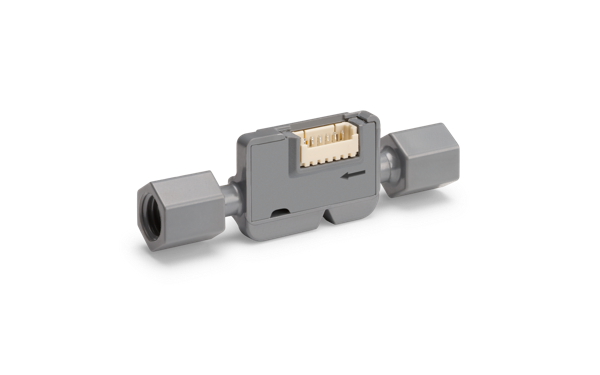

# Python I2C Driver for Sensirion SF06-LF

This repository contains the Python driver to communicate with the Sensirion
SF06-LF sensor family over I2C. 

<center></center>

Click [here](https://sensirion.com/products/product-categories/liquid-flow/) 
to learn more about the Sensirion SF06-LF sensor family.

Not all sensors of this driver family support all measurements.
In case a measurement is not supported by all sensors, the products that
support it are listed in the API description.

## Supported sensor types

   - SLF3C-1300F

   - SLF3S-1300F

   - SLF3S-0600F

   - SLF3S-4000B

   - LD20-0600L

   - LD20-2600B

The following instructions and examples use a *SLF3C-1300F*. Click [here](https://sensirion.com/media/documents/F3931025/621F8CCE/Sensirion_Liquid_Flow_Meters_SLF3C-1300F_Datasheet.pdf
) to download the datasheet.


## Usage

See user manual at [https://sensirion.github.io](https://sensirion.github.io/python-i2c-sf06-lf).

#### Detaild sensor pinout


| *Pin* | *Cable Color* | *Name* | *Description*  | *Comments* |
|-------|---------------|:------:|----------------|------------|
| 1 |  |NC | Do not connect | 
| 2 | green |SDA | I2C: Serial data input / output | 
| 3 | red |VDD | Supply Voltage | 3.2 to 3.8V
| 4 | black |GND | Ground | 
| 5 | yellow |SCL | I2C: Serial clock input | 
| 6 |  |NC | Do not connect | 

## Development

We develop and test this driver using our company internal tools (version
control, continuous integration, code review etc.) and automatically
synchronize the `master` branch with GitHub. But this doesn't mean that we
don't respond to issues or don't accept pull requests on GitHub. In fact,
you're very welcome to open issues or create pull requests :)

### Check coding style

The coding style can be checked with [`flake8`](http://flake8.pycqa.org/):

```bash
pip install -e .[test]  # Install requirements
flake8                  # Run style check
```

In addition, we check the formatting of files with
[`editorconfig-checker`](https://editorconfig-checker.github.io/):

```bash
pip install editorconfig-checker==2.0.3   # Install requirements
editorconfig-checker                      # Run check
```

### Run tests

Unit tests can be run with [`pytest`](https://pytest.org/):

```bash
pip install -e .[test]                       # Install requirements
pytest -m "not needs_device"                 # Run tests without hardware
pytest                                       # Run all tests
pytest -m "needs_device"  # Run all tests for SPS6x

```

The tests with the marker `needs_device` have following requirements:

- The SF06-LF sensor must be connected to a
  [SensorBridge](https://www.sensirion.com/sensorbridge/) on port 1.
- Pass the serial port where the SensorBridge is connected with
  `--serial-port`, e.g. `pytest --serial-port=COM7`
- The SensorBridge must have default settings (baudrate 460800, address 0)


### Build documentation

The documentation can be built with [Sphinx](http://www.sphinx-doc.org/):

```bash
python setup.py install                        # Install package
pip install -r docs/requirements.txt           # Install requirements
sphinx-versioning build docs docs/_build/html  # Build documentation
```

## License

See [LICENSE](LICENSE).
